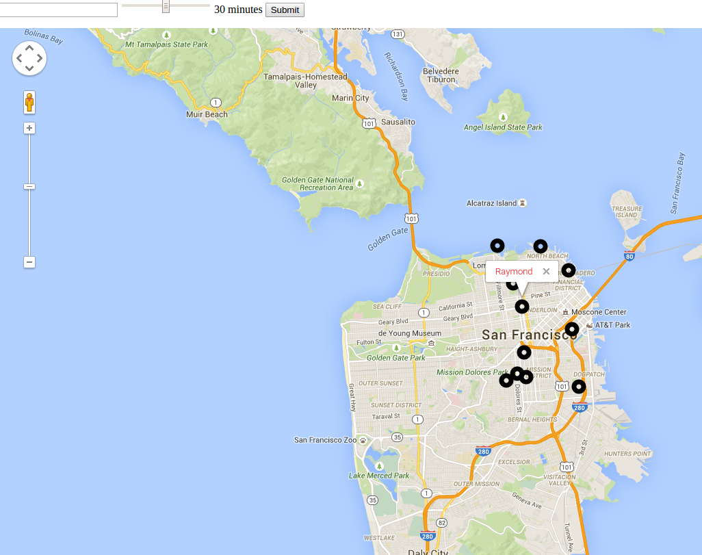

# PAM (People Around Me)#

## What ##
  > AroundMe

## Who would use this ##
  > People who are too shy to go up to people and talk to them

## Summary ##
  > This app is to make new friends in real life, decoupled from tech.

## Problem ##
  > People are reticent to talk to others due to coming off as creepy. This app can connect mutually shy people.

## Solution ##
  > Since this is an app on a phone, it increases privacy. People can choose whether to talk or meet others. Basically meetup with less flaking.

## Quote ##
  > Spontaineity! No more scheduling to meet fun people and make friends.

## How to Get Started when app is ready ##
  > Fill in your profile and just click "Ready!". You will see a bunch of people around you that you can meet and have a conversation with.

## Customer Quote ##
  > "I met my best friend using AroundMe".

URL: www.pam.herokuapp.com

